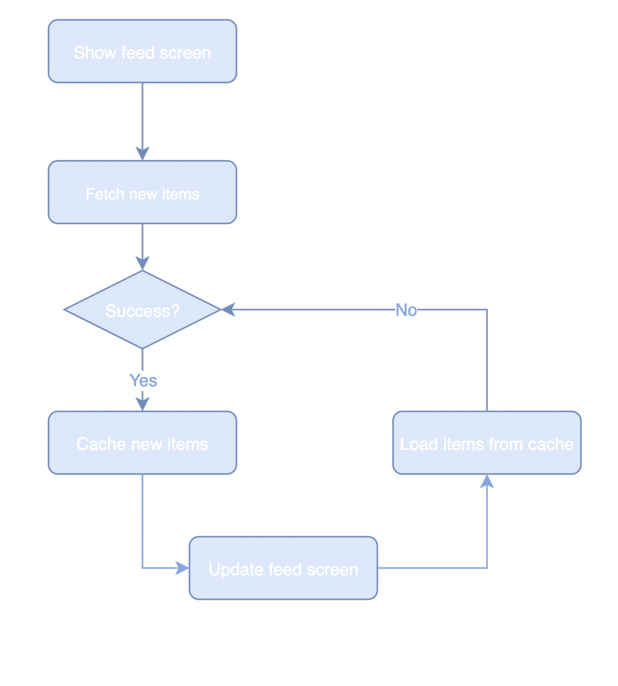

#  Place Feed Feature

## BDD Specs

### Story: Customer requests to see the feed

### Narrative #1

        As an online customer
        I want the app to automatically load the place feed around my location
        So I can always enjoy the places around my location

### Scenarios (Acceptance criteria)

        Given the customer has connectivity and location is authorized
        When the customer requests to see the feed
        Then the app should display the latest feed from remote
            And replace the cache with the new feed
            
        Given the customer has connectivity and location is not authorize
        When the customer requests to see the feed
        Then the app should display an error message

### Narrative #2
    
        As an offline customer
        I want the app to show the latest saved version of my place feed
        So I can always enjoy places
        
### Scenarios (Acceptance criteria)

        Given the customer doesn't have connectivity
        When the customer requests to see the feed
        Then the app should display the latest feed saved
        
        Given the customer doesn't have connectivity
        And the cache is empty
        When the customer requests to see the feed
        Then the app should display an error message

## Use Cases

### Load Feed

#### Data:

- URL

#### Primary course (happy path):

1. Execute "Load Feed Items" command above the data.
2. System downloads data from the URL.
3. System validates downloaded data.
4. System creates feed items from valid data.
5. System delivers feed items.

#### Invalid data - error course (sad path) :

1. System deliverss error.

#### No connectivity - error course (sad path):

1. Systems delivers error.

###  Load Feed Fallback (Cache)

#### Data:

- Max age

#### Primary course

1. Execute "Retrieve Feed Items" command with above data.
2. System fetches feed data from cache
3. System creates feed items from cached data.
4. Systems delivers feed items.

#### No cache course (sad path):

1. System delivers no feed items.

### Save Feed Items

#### Data

- Feed items

#### Primary course (happy path)

1. Execute "Save Feed Items" command with above data.
2. System encodes  feed items.
3. System timestamps the new cache.
4. System replaces the cache with new dara.
5. System delivers success message.

## Flowchart

## Architecture

## Model Specs

### Feed Item

| Property   |     Type      | 
|----------|:-------------:|
| id |  UUID | 
| name|    String (optional)   | 
| address |    String (optional)   | 
| city|  String (optional) |  
| categoryName |  String (optional) |  
| distance | Int(optional) |

